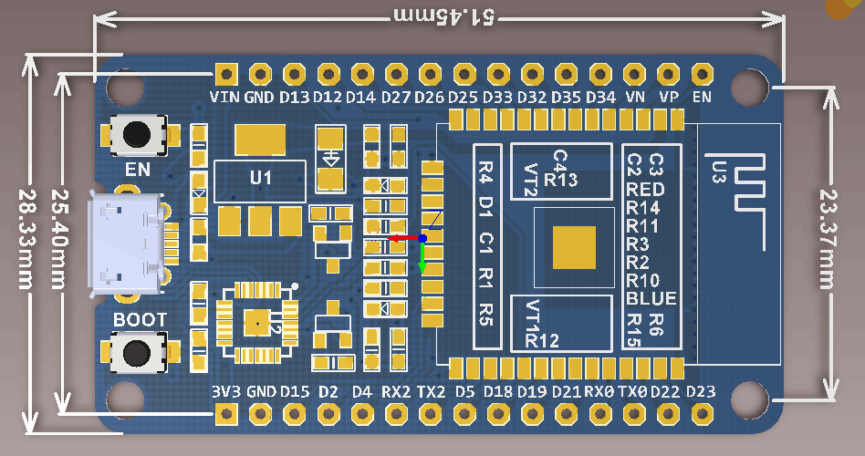
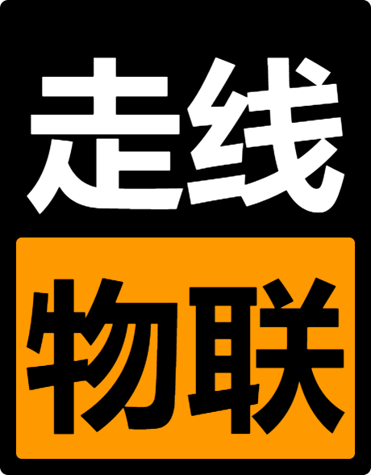

# Iot-Platform-PCB
走线物联智能硬件PCB设计图纸

## IoT-Switch

单/双路智能开关设计图

### 设计需求

前期还是以开发为主，所以脱离不了开发板，但是又想整合一下，所以智能开关电路板的设计思路如下:

* **大前提: 电路板上的元件和接插件都需要 `直插式` 的，因为我不会焊贴片的。。。。**

* 需要使用针座把开发板接插在电路板上，但是要考虑不同开发板的通用性

> 我购买的 ESP32 开发板是 `DevKit V1`，针脚位置布局好像和其它的不太一样

* 需要集成 1~2 个继电器，光耦隔离、三极管、电阻之类的外围电路要可靠

* 需要 2 ~ 3 个按键，1 ~ 2 个作为智能开关的手动开关，1个作为复位和配网按钮

* 需要 3 个指示灯，分别是
	* 电源指示灯，红色
	* 工作状态指示灯，多色灯没用过不知道怎么接线，所以还是用 LED 吧，绿色
	* 配网指示灯，橙色

* 需要丝印 `走线物联 Logo` 和 网址 `walkline.wang/iot` (Logo 根据情况选取横版或竖版)

* 电源接口暂时考虑使用 `USB` 或 `DC21` 接口

* 尺寸 `10 * 10` 以内 (希望嘉立创的活动不要取消。。。。)

* 电路板四角打过孔以备接铜柱用

* 电路板切圆角，美观

### 导线连接

	接线是以 DevKit V1 的 GPIO 定义为基准

> **不要使用的 GPIO 包括: `D2`, `D12`, `EN`, `RX0`, `TX0`**

* 按键可以使用: `D35`, `D34`, `VN`, `VP` (**Input Only**，待验证)

* 继电器使用 `VIN` 供电

* 继电器控制和 LED 可以使用: `D13`, `D27`, `D26`, `D25`, `D33`, `D32`, `D4`, `D18`, `D19`, `D21`, `D22`, `D23`

### 附件

* [继电器模块电路图](http://baidu.com)

* DevKit V1 开发板

* 横版 Logo

* 竖版 Logo

